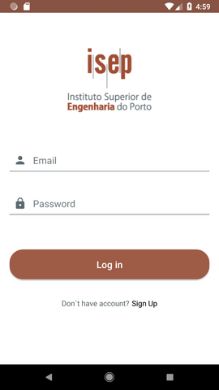
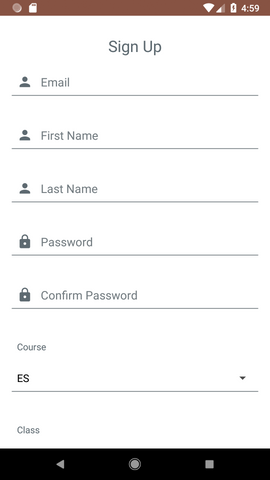
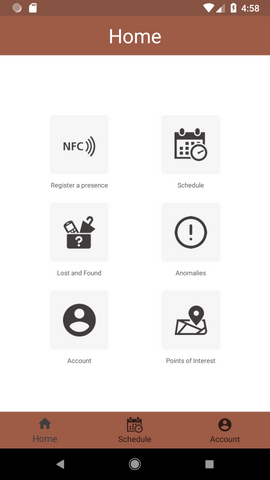
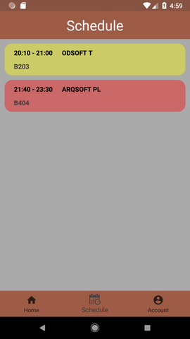
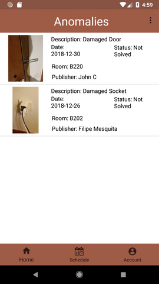
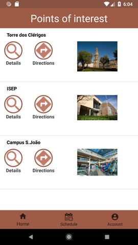
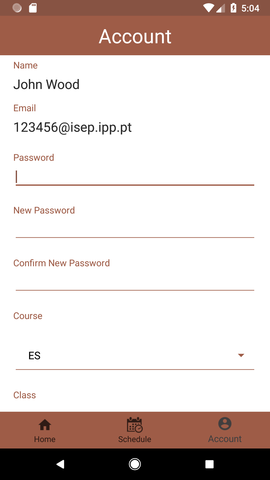

# Student HandBook App

## Functional Requirements

- Authentication service
- Register a presence with NFC and Google Calendar
- List Schedule using Google Calendar
- List and report Lost and Founds
- List and report Ananomalies
- List Anomalies filtering by user
- Send Notifications by topics using cloud messaging from firebase
- Manage Account
- List Points of Interest, allow us to call and get directions

## APIs

- Firebase
- Google Maps
- Google Calendar
- Cloud Messaging from Firebase

## Technologies

- NFC
- Wifi
- GPS
- Mobile Camera

## GUIs

 

## Authors

* **Filipe Mesquita** - [filipemes](https://github.com/filipemes)

* **João Pinto**

* **Miguel Silva**

